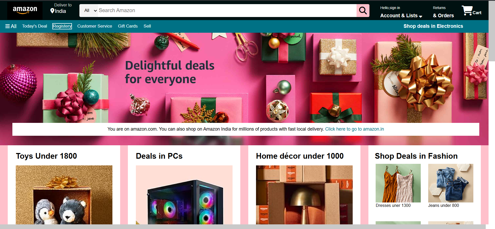

# 🛒 Amazon Clone Frontend (HTML + CSS Only)

<p align="center">
  
</p>

---

[🔗 Live Demo](https://neerajkumar151.github.io/Amazon-frontend/clone_amazon.html)

A clean and responsive **Amazon homepage clone** built using **pure HTML and CSS**. This project mimics the visual structure and layout of Amazon India, focusing on UI and responsiveness without any JavaScript.


---

## ✨ Features

- ✅ Fully responsive Amazon-style layout
- ✅ Reusable sections and components
- ✅ Custom navigation bar, banner, and product grid
- ✅ Pure HTML5 and CSS3 – no frameworks or JavaScript
- ✅ Clean and readable code structure
- ✅ Hosted via GitHub Pages

---

## 🧑‍💻 Tech Stack

| Technology | Description              |
|------------|--------------------------|
| HTML5      | Page structure and content |
| CSS3       | Styling and layout        |
| GitHub Pages | Deployment platform     |

---

## 📂 Folder Structure
Amazon-frontend/
│
├── clone_amazon.html # Main HTML page
├── style.css # CSS styles for Amazon clone
├── assets/ # Images, logos, screenshot, etc.
│ └── preview.png # Optional screenshot for README
└── README.md # Project documentation

---

## 🚀 How to Run Locally

1. **Clone the repository**
```bash
git clone https://github.com/Neerajkumar151/Amazon-frontend.git
```
2. **Open the project folder**
```bash
   cd Amazon-frontend
```
3. **Open clone_amazon.html in your web browser**

---

## 🌍 Deployment

This project is hosted on **GitHub Pages**  
🔗 [Click to Visit](https://neerajkumar151.github.io/Amazon-frontend/clone_amazon.html)

---

## 🔮 Future Plans

- Add interactivity with JavaScript  
- Implement cart and wishlist functionality  
- Connect with backend or Firebase  
- Build full-stack Amazon clone using React + Node.js

---

## 🙋‍♂️ About Me

**Neeraj Kumar**  
🎓 Final Year B.Tech IT Student  
🏫 GL Bajaj Institute of Technology & Management, Greater Noida  
🌐 [GitHub Profile](https://github.com/Neerajkumar151)

---

## ⭐ Show Some Love

If you like this project:

- ⭐ Star the repo  
- 📌 Share it  
- 📥 Fork it  
- 💡 Contribute your ideas  

---

## 📄 License

This project is licensed under the [MIT License](https://opensource.org/licenses/MIT).

